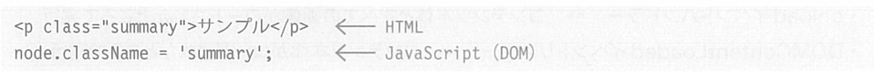
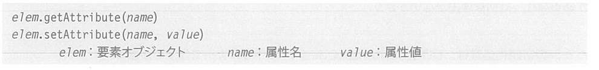

## 6.3.1 大多数属性都可以使用「元素节点的同名的属性」来访问
&emsp;&emsp;正如清单6-13中所看到的，如果可以访问到元素节点，那么访问其属性值就很简单。这是因为大多数的属性都可以作为「元素节点的同名属性」来访问。 
&emsp;&emsp;例如要获取／设定锚标签的href属性，可以如下记述（变量link表示锚标签）。

> 获取 设定

&emsp;&emsp;其他的属性也都大致相同，但是，请注意有部分属性名不一致的情况。 
&emsp;&emsp;例如，表示元素使用的CSS类的「class」属性，对应的DOM属性是「className」。常用的属性中，可以认为就这点差异，但还是要记住「存在属性不一致的情况」这一点。

> 示例

 
&emsp;&emsp;如果不想留意属性名的差异，请使用getAttribute／setAttribute方法。  
**●写法 getAttribute／setAttribute方法**

>elem：元素对象 name：属性名 value：属性值

&emsp;&emsp;例如，要获取／设定锚标签（变量link）的href属性，请像下面这样书写。
####### 【299页】

 
&emsp;&emsp;虽然和使用属性来访问相比变得稍微冗长了点，但是有以下好处。
- 没有必要留意HTML和JavaScript的名字差异
- （因为是使用字符串来指定的）可以通过脚本动态改变要获取／设定的属性名
  
&emsp;&emsp;请根据使用的场景区分使用。