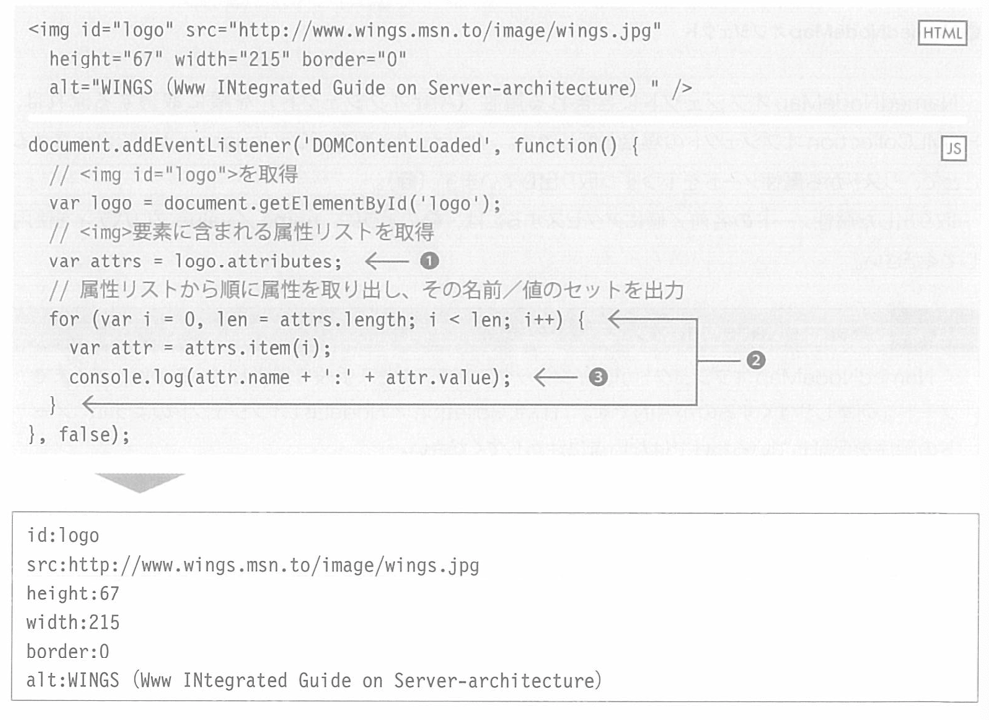

## 6.3.2 获取没有特别指定的属性
&emsp;&emsp;要获取特定的节点的所有属性时，可以使用attributes属性。下面，是获取``元素中的所有属性并罗列出来的代码。  
**●清单6-14 attributes.html（上）／attributes.js（下）**

> // 获取`` // 获取``元素中的属性列表 // 依次从属性列表中取出属性，并输出其名字／值

 
&emsp;&emsp;attributes属性，将元素中包含的所有属性的列表作为NamedNodeMap对象返回（①）。NamedNodeMap是和之前的HTMLCollection相似的对象，特点是「使用节点的名称或者索引都可以访问」。
#####【300页】

> attributes属性 → 从元素中获取所有的属性节点 NamedNodeMap对象.length NamedNodeMap：使用名称、索引都可以访问节点

**●NamedNodeMap对象**  
&emsp;&emsp;依次从NamedNodeMap对象中获取属性（Attr对象）的流程，和HTMLCollection对象是一样的。索引从「0～length-1」变化，从列表中逐个取出属性节点（②）。 
&emsp;&emsp;要访问取出的属性节点的名称／值，请像③这样，使用name／value属性。  
**Note NamedNodeMap对象的特征** 
&emsp;&emsp;NamedNodeMap对象，提供使用索引的访问方法，只是为了更简单地罗列节点。请注意，像HTMLCollection／NodeList对象这样，不保证节点的顺序。 
&emsp;&emsp;另外，在NamedNodeMap对象中，也可以添加／删除其中的节点（属性）。

> // 新增title属性 'logo图片' // 删除现有的alt属性
